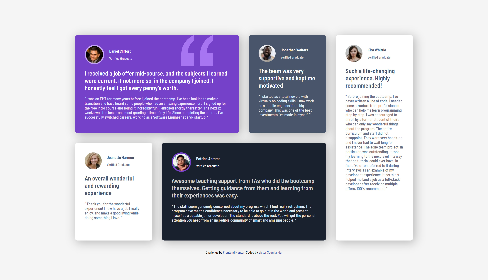

# Frontend Mentor - Testimonials grid section solution

This is a solution to the [Testimonials grid section challenge on Frontend Mentor](https://www.frontendmentor.io/challenges/testimonials-grid-section-Nnw6J7Un7). Frontend Mentor challenges help you improve your coding skills by building realistic projects. 

## Table of contents

- [Overview](#overview)
  - [The challenge](#the-challenge)
  - [Screenshot](#screenshot)
  - [Links](#links)
- [My process](#my-process)
  - [Built with](#built-with)
  - [What I learned](#what-i-learned)
  - [Continued development](#continued-development)
  - [Useful resources](#useful-resources)
  - [AI Collaboration](#ai-collaboration)
- [Author](#author)

**Note: Delete this note and update the table of contents based on what sections you keep.**

## Overview

### The challenge

Users should be able to:

- View the optimal layout for the site depending on their device's screen size

### Screenshot



### Links

- Solution URL: [Add solution URL here](https://your-solution-url.com)
- Live Site URL: [Add live site URL here](https://your-live-site-url.com)

## My process

### Built with

- Semantic HTML5 markup
- CSS custom properties
- CSS utilities
- Flexbox
- CSS Grid
- Mobile-first workflow
- BEM naming convention

### What I learned

#### CSS Utility Classes

This was my first time applying the concept of **utility classes** in a project. Instead of writing one-off styles inside component rules, I created small, single-purpose classes for colors, font sizes, and font weights that I could combine freely in the HTML. The reusability made styling much faster and kept the CSS lean.

```css
/* Color utilities */
.text-color-white        { color: var(--white); }
.text-color-grey-400     { color: var(--grey-400); }

/* Font-size utilities */
.text-size-11 { font-size: var(--font-11-size); }
.text-size-13 { font-size: var(--font-13-size); }
.text-size-20 { font-size: var(--font-20-size); }

/* Background utilities */
.bg-color-purple-500  { background-color: var(--primary-purple-500); }
.bg-color-dark-blue   { background-color: var(--dark-blue); }
```

Applying them directly in the markup means I never have to open the CSS file just to change a card's background color — I simply swap a class on the element.

#### CSS Grid Areas

I had used CSS Grid before, but this project let me go deeper into **named grid areas**. Defining a visual "map" of the layout with `grid-template-areas` and then assigning each card to its area with `grid-area` made the responsive progression from tablet to desktop very easy to reason about.

```css
/* Tablet — 2-column layout */
@media (min-width: 48em) {
    .testimonials--grid-layout {
        grid-template-columns: 1fr 1fr;
        grid-template-rows: repeat(4, 1fr);
        grid-template-areas:
            'daniel    daniel'
            'jonathan  jeanette'
            'patrick   patrick'
            'kira      kira';
    }
}

/* Desktop — 4-column layout */
@media (min-width: 90em) {
    .testimonials--grid-layout {
        grid-template-columns: repeat(4, 1fr);
        grid-template-rows: 1fr 1fr;
        grid-template-areas:
            'daniel   daniel   jonathan  kira'
            'jeanette patrick  patrick   kira';
    }
}

/* Assigning each card to its named area */
.testimony--daniel   { grid-area: daniel; }
.testimony--jonathan { grid-area: jonathan; }
.testimony--jeanette { grid-area: jeanette; }
.testimony--patrick  { grid-area: patrick; }
.testimony--kira     { grid-area: kira; }
```

The ASCII-art style of `grid-template-areas` makes it immediately obvious where each card sits on the page, which is a big win for maintainability.

### Continued development

Since this is the first time I’ve implemented it, I’d like to explore the concept of “utilities” in more depth. I found the reusability and simplicity of this concept to be extremely helpful.

### Useful resources

- [Sizing items in CSS](https://developer.mozilla.org/en-US/docs/Learn_web_development/Core/Styling_basics/Sizing) - An MND article that helped me understand image resizing.
- [CSS background-position Property](https://www.w3schools.com/cssref/pr_background-position.php) - An article from W3Schools that helped me understand how the “background-position” property works for managing the position of background images in elements.
- [An Interactive Guide to CSS Grid](https://www.joshwcomeau.com/css/interactive-guide-to-grid/) - An article by Josh Comeau that presents the concept of grids and their features in an interactive way. It helped me implement grid areas.

### AI Collaboration

I used **Claude (claude.ai/code)** as an AI pair-programming assistant throughout this project.

**How I used it:**

- **HTML structure review** — After writing the semantic markup and applying the BEM naming convention, I asked Claude to review my structure. It provided feedback on whether the element/modifier hierarchy was consistent and pointed out places where the naming could be clearer or more aligned with BEM conventions.
- **README writing** — Claude helped me draft and format this README, in particular the *What I learned* and *AI Collaboration* sections, by asking me what concepts I wanted to highlight and then translating my input into clear written explanations with matching code samples.

**What worked well:** Having a second pair of eyes on the HTML before moving on to CSS caught a few naming inconsistencies early. The collaborative back-and-forth for the README also saved time while still making sure the content reflects my own experience.

**What didn't work as well:** Because Claude can't open a browser, all UI feedback was based on reading the code rather than visually inspecting the rendered result — that part still required my own DevTools debugging.

## Author

- Website - [Add your name here](https://www.your-site.com)
- Frontend Mentor - [@yourusername](https://www.frontendmentor.io/profile/yourusername)
- Twitter - [@yourusername](https://www.twitter.com/yourusername)
